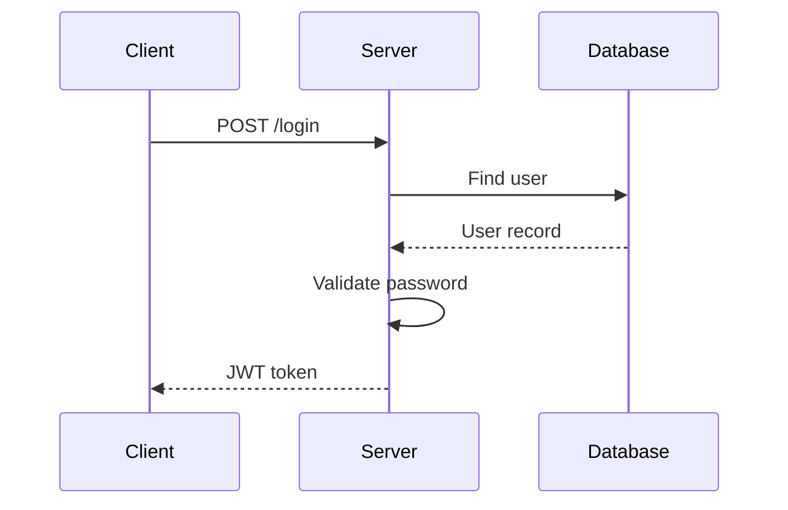

# command-explain

A Claude Code slash command for generating deep-dive code explanations with diagrams.

## Installation

```bash
# Clone to your preferred location
git clone git@github.com:claude-commands/command-explain.git <clone-path>/command-explain

# Symlink (use full path to cloned repo)
ln -s <clone-path>/command-explain/explain.md ~/.claude/commands/explain.md
```

## Usage

```
/explain src/auth/login.ts          # Explain a file
/explain handleAuthentication       # Explain a function
/explain src/services/              # Explain a module/directory
```

## What it does

1. Analyzes the specified code target
2. Extracts key concepts, dependencies, and relationships
3. Generates documentation-style explanation
4. Creates Mermaid diagrams for complex flows
5. Identifies potential improvements and edge cases

## Output Format

```markdown
# handleAuthentication

## Overview
Validates user credentials and creates a session token...

## Key Concepts
- **JWT Tokens**: Used for stateless authentication
- **Bcrypt**: Password hashing algorithm

## How It Works
1. Receives username and password
2. Looks up user in database
3. Validates password hash
4. Generates JWT with user claims
5. Returns token and refresh token

## Diagram


## Features

- **Multi-target**: Explain files, functions, or directories
- **Mermaid diagrams**: Flowcharts, sequence diagrams, class diagrams
- **Layered depth**: Adjusts detail based on complexity
- **Context-aware**: Links to related code and tests
- **Onboarding-friendly**: Written for unfamiliar readers

## Diagram Types

| Type | Best For |
|------|----------|
| Flowchart | Control flow, algorithms, decisions |
| Sequence | API calls, service interactions |
| Class | OOP structures, relationships |
| State | State machines, lifecycle |

## Requirements

- Git repository with source code
- Claude Code with Opus 4.5 model access

## Updates

```bash
cd <clone-path>/command-explain && git pull
```
